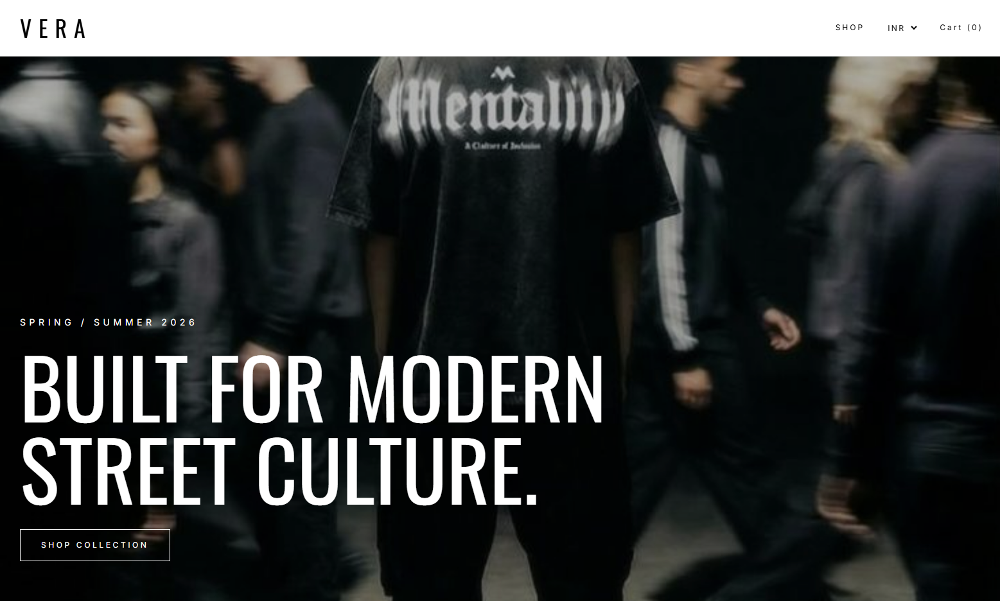
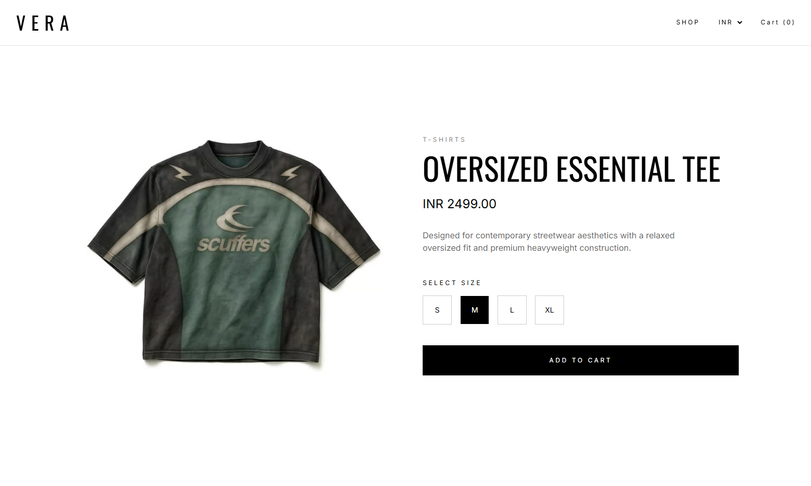
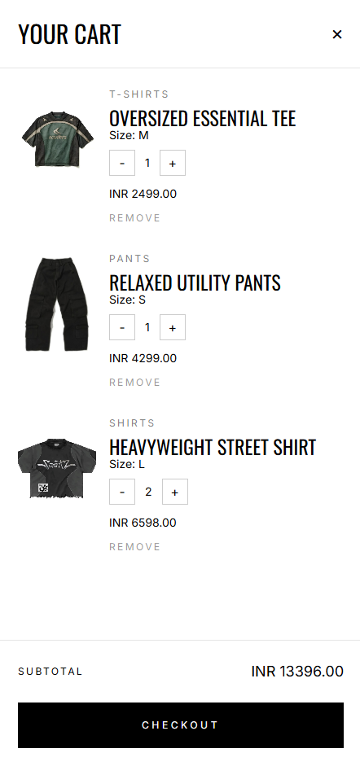

# VERA — Modern Streetwear Ecommerce Frontend

VERA is a premium streetwear ecommerce storefront built with React and Vite, inspired by contemporary fashion platforms that combine editorial-style layouts with modern ecommerce interactions.

The project was developed to simulate a realistic frontend architecture for a fashion brand while focusing on scalable React development patterns, reusable component systems, global state management, API integration, and premium user experience design.

---

## Live Demo

[View Live Project](https://vera-streetwear.vercel.app)

---

## Project Overview

VERA was designed as a portfolio-grade frontend ecommerce application tailored toward modern streetwear and fashion brands.

The goal of the project was to recreate the visual and interaction quality commonly seen in premium fashion storefronts while implementing practical frontend engineering concepts used in real-world applications.

The storefront combines:

- Minimal editorial-inspired UI
- Dynamic product rendering
- Interactive cart management
- Global state architecture
- Live currency conversion
- Reusable React component systems
- Modern ecommerce UX patterns

The overall visual direction takes inspiration from contemporary streetwear brands that prioritize typography, whitespace, campaign imagery, and clean product presentation.

---

## Screenshots

> Add your project screenshots here.

### Homepage


### Product Page


### Shopping Cart


---

## Features

### Ecommerce Functionality

- Dynamic product pages using React Router
- Interactive shopping cart system
- Quantity management
- Variant-aware cart handling
- Persistent cart state using localStorage
- Dynamic product rendering from JSON data
- Live currency conversion system
- Responsive product grid architecture

---

### Frontend Architecture

- Component-driven React architecture
- Shared layout routing structure
- Global state management using Context API
- Reusable UI components
- Dynamic rendering using mapped data
- Async API fetching patterns
- Derived state management
- Scalable folder structure

---

### User Experience

- Slide-out cart drawer interactions
- Sticky navigation system
- Smooth hover animations
- Loading skeleton placeholders
- Editorial-inspired typography system
- Minimal luxury-focused visual design
- Smooth UI transitions
- Fashion-oriented layout rhythm

---

## Tech Stack

### Frontend

- React
- Vite
- React Router
- Tailwind CSS
- JavaScript (ES6+)

### State Management

- Context API

### APIs

- Exchange Rate API

### Deployment

- Vercel

---

## Folder Structure

```txt
src/
├── assets/
├── components/
├── context/
├── hooks/
├── pages/
├── router/
├── services/
├── styles/
└── data/
```

---

## Key Concepts Practiced

This project was built to strengthen practical frontend engineering skills including:

- Component architecture
- Client-side routing
- Context API state management
- Dynamic rendering patterns
- API integration
- Responsive UI systems
- Ecommerce interaction design
- Async data handling
- Persistent browser storage
- Reusable design systems
- Modern frontend deployment workflows

---

## Future Improvements

Planned future enhancements include:

- Mobile-first responsive optimization
- Product search functionality
- Advanced filtering and sorting
- Wishlist system
- Checkout flow simulation
- Authentication integration
- Framer Motion page transitions
- Backend integration
- CMS-driven product management

---

## Design Inspiration

The visual direction of this project was inspired by modern streetwear and fashion ecommerce platforms that emphasize:

- Editorial layouts
- Large-scale typography
- Minimal monochrome palettes
- Strong product storytelling
- High-end fashion presentation

---

## Performance & UX Goals

The application was developed with a focus on:

- Clean component scalability
- Smooth user interactions
- Minimal visual clutter
- Fast navigation experience
- Consistent layout rhythm
- Premium ecommerce presentation

---

## Author

Developed by Usaid Ahmed.
linkedin: https://www.linkedin.com/in/m-usaid/